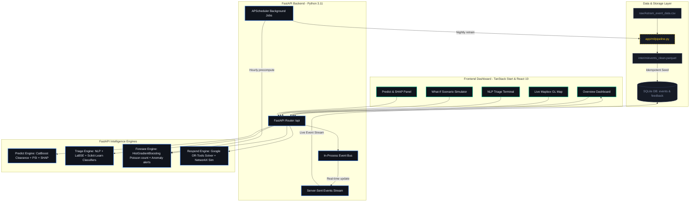

#  PRAVAH (प्रवाह) — Traffic Control Room Intelligence & Command Dashboard

**PRAVAH** is a real-time, high-density urban traffic intelligence and dispatch platform designed for control room officers, fleet dispatchers, and traffic authority supervisors. It provides unified situational awareness by blending a live Mapbox-powered city map with a suite of predictive machine learning models, natural language processing (NLP) triage, response dispatch optimization, and what-if congestion propagation simulations.

---

## 📖 Table of Contents
1. [System Architecture](#-system-architecture)
2. [Core Technology Stack](#-core-technology-stack)
3. [Intelligence Engines (Deep Dive)](#-intelligence-engines-deep-dive)
4. [Visual Design System](#-visual-design-system)
5. [Repository Structure](#-repository-structure)
6. [Getting Started & Setup Guide](#-getting-started--setup-guide)
7. [Authentication & Security](#-authentication--security)
8. [Testing & Verification](#-testing--verification)

---

## 🏗️ System Architecture

PRAVAH is organized as a two-tier system: a highly interactive frontend dashboard and a modular backend serving predictions via FastAPI.



---

## 🛠️ Core Technology Stack

### Frontend Dashboard
* **Framework**: React 19, [TanStack Start](file:///Users/himanshusolanki/Desktop/Flipkart/Pravah/frontend/src/start.ts) (combines TanStack Router, Vite, and server functions).
* **Styling**: Tailwind CSS v4, Vanilla CSS tokens (dynamic dark/light themes), custom micro-animations (pulsing severe incident rings, progress bars).
* **Map & Data Viz**: Mapbox GL (`react-map-gl`), Recharts (volume spikes, trends), Lucide React.
* **Component Library**: Radix UI Primitives (Accordion, Dialog, Popover, Slider, Tabs, etc.).
* **State & Forms**: React Hook Form, Zod (schemas validation), Jotai/React State.

### Backend API & ML Stack
* **Web Server**: FastAPI, Uvicorn, Pydantic v2 (settings & request models validation).
* **Database**: SQLite, SQLAlchemy (object mapping), Alembic (migrations).
* **Data Processing**: Pandas, Numpy, PyArrow.
* **Machine Learning**: 
  - **CatBoost**: Multi-quantile regression models (serving `p10`, `p50`, and `p90` intervals).
  - **Sentence Transformers (LaBSE)**: High-quality multilingual sentence embeddings.
  - **Scikit-Learn**: Multiclass and binary classification heads (cause & priority classification).
  - **SHAP (SHapley Additive exPlanations)**: Tree SHAP for explainable local prediction contributions.
* **Network & Optimization**:
  - **Google OR-Tools**: CP-SAT (Constraint Programming) solver for unit dispatch routing.
  - **NetworkX**: Topological graph modeling for spillover delay propagation.
* **Background Tasks**: APScheduler (cron/interval tasks execution).

---

## 🧠 Intelligence Engines (Deep Dive)

### 1. Data Pipeline (`app/ml/pipeline.py`)
Processes the raw traffic CSV (`Astram_event_data_anonymized.csv`) into clean parquet:
* Parses UTC timestamps and converts them to **IST (Asia/Kolkata)**.
* Derives temporal features: `hour_ist`, `dow` (0=Monday), `is_weekend`, `is_night` (22:00-04:59), and `is_rush` (08:00-10:59 & 17:00-20:59) using [temporal.py](file:///Users/himanshusolanki/Desktop/Flipkart/Pravah/backend/app/features/temporal.py).
* Standardizes categorical fields (e.g., normalizes event causes, maps debris variations).

### 2. Predict Engine (`app/engines/predict/`)
Provides clearance time estimation and severity assessment:
* **Quantile Prediction ([clearance.py](file:///Users/himanshusolanki/Desktop/Flipkart/Pravah/backend/app/engines/predict/clearance.py))**: CatBoostRegressor serves `p10/p50/p90` estimates. Implements monotonicity constraints to guarantee $p10 \le p50 \le p90$ and enforces a 1-minute minimum clearance.
* **Problem Severity Index (PSI) ([severity.py](file:///Users/himanshusolanki/Desktop/Flipkart/Pravah/backend/app/engines/predict/severity.py))**: Computes a transparent $0$-$100$ score and assigns a severity tier (`low`, `moderate`, `high`, `severe`) based on:
  $$\text{PSI} = 55\% \times \text{ClearanceTime} + 20\% \times \text{RoadClosure} + 25\% \times \text{CorridorVolumeRatio}$$
* **SHAP Explanations ([explain.py](file:///Users/himanshusolanki/Desktop/Flipkart/Pravah/backend/app/engines/predict/explain.py))**: Runs fast tree SHAP on the `p50` model to present feature contributions (in minutes added or subtracted) live to operators.
* **Queue Ripple Heuristic ([ripple.py](file:///Users/himanshusolanki/Desktop/Flipkart/Pravah/backend/app/engines/predict/ripple.py))**: Estimates physical spillback footprints (in kilometers) and the minute congestion peaks.

### 3. Triage NLP Engine (`app/engines/triage/`)
Classifies unstructured incoming emergency text (SMS, logs, operator inputs):
* **Vectorization**: Transforms cleaned text using a local `LaBSE` (Language-Agnostic BERT Sentence Embedding) embedder.
* **Classification ([model.py](file:///Users/himanshusolanki/Desktop/Flipkart/Pravah/backend/app/engines/triage/model.py))**: Feeds embeddings into two scikit-learn classifiers:
  1. *Cause Head*: Multiclass classifier identifying incident cause (e.g., accident, waterlogging).
  2. *Priority Head*: Binary classifier deciding priority (`High` vs `Low`).
* **Location Resolution ([locate.py](file:///Users/himanshusolanki/Desktop/Flipkart/Pravah/backend/app/engines/triage/locate.py))**: Uses `RapidFuzz` to match location keywords from the free text against known corridors/junctions in the database using token-set ratio similarity.
* **Remediation Actions ([actions.py](file:///Users/himanshusolanki/Desktop/Flipkart/Pravah/backend/app/engines/triage/actions.py))**: Recommends an ordered checklist of remediation strategies tailored to the event's cause and derived severity.

### 4. Foresee Engine (`app/engines/foresee/`)
Predicts short-term future risk profiles and detects anomalies:
* **Incidence Forecasting ([hotspot.py](file:///Users/himanshusolanki/Desktop/Flipkart/Pravah/backend/app/engines/foresee/hotspot.py))**: Fits a Poisson regressor (`HistGradientBoostingRegressor`) over cyclical hour/day features to predict expected incident rates per corridor. Outputs Poisson probability of $\ge 1$ incident:
  $$P(\ge 1 \text{ incident}) = (1 - e^{-\lambda}) \times 100\%$$
* **GeoJSON Hotspots**: Generates randomized coordinates jittered within $450\text{m}$ of the corridor centroid, weighted by predicted risk, to map visual density grids.
* **Anomaly Detection ([anomaly.py](file:///Users/himanshusolanki/Desktop/Flipkart/Pravah/backend/app/engines/foresee/anomaly.py))**:
  - *Spikes*: Computes a rolling 7-day Z-score on daily incident counts to flag anomalous spikes ($z \ge 2.0$).
  - *Clusters*: Runs a DBSCAN clustering algorithm over active lat/lng coordinates (with Haversine metric and $1\text{km}$ radius) to find spatial incident clusters.

### 5. Respond Engine (`app/engines/respond/`)
Provides resource coordination and simulation:
* **Constraint Solver ([optimizer.py](file:///Users/himanshusolanki/Desktop/Flipkart/Pravah/backend/app/engines/respond/optimizer.py))**: Uses Google OR-Tools `CP-SAT` integer programming to assign dispatchable units (pre-positioned at depots) to active incidents. Objective: maximize covered value ($\sum \text{Priority} \times p50$), subject to a distance ceiling (e.g., $8\text{km}$) and $1$-to-$1$ assignments. Falls back to a greedy heuristic if CP-SAT fails.
* **What-If Scenario Simulator ([whatif.py](file:///Users/himanshusolanki/Desktop/Flipkart/Pravah/backend/app/engines/respond/whatif.py))**: Models corridors as a graph (network links share a zone). Propagates congestion using hop-decay heuristics:
  $$\text{Delay} = \text{Criticality} \times \text{Duration} \times 30\text{ min} \times 0.4^{\text{hop}}$$
  Calculates affected vehicles, carbon emissions, and generates GeoJSON detour LineStrings.

### 6. Scheduler (`app/learning/scheduler.py`)
Utilizes `BackgroundScheduler` (APScheduler) for maintenance:
* **Nightly retraining (02:00 IST)**: Triggers the full training sequence (`train_all()`) and hot-swaps model singletons in memory without causing server downtime.
* **Hourly precomputation**: Refreshes hotspot coordinates and corridor risk scores to warm spatial caches.

---

## 🎨 Visual Design System

PRAVAH implements a sleek, high-density aerospace-themed design optimized for 24/7 operations room monitoring. Refer to [desgin.md](file:///Users/himanshusolanki/Desktop/Flipkart/Pravah/frontend/desgin.md) for full specs.

### Color Tokens
* **Base Void**: `#0A0D12` (deep control room canvas)
* **Surface Levels**: Surface-0 (`#10141C`) $\rightarrow$ Surface-1 (`#161B26` cards) $\rightarrow$ Surface-2 (`#1E2535` active overlays) $\rightarrow$ Surface-3 (`#252D40` inputs & hovers).
* **Teal Brand Accent**: `#00C896` (symbolizes fluid flow and green status).
* **Semantic Tiers**: 
  - 🟢 **Low** (PSI 0-30): `#4ADE80`
  - 🟡 **Moderate** (PSI 31-60): `#FACC15`
  - 🟠 **High** (PSI 61-80): `#F97316`
  - 🔴 **Severe** (PSI 81-100): `#EF4444` (pulsing animations trigger on active markers).

### Typography
* **Headers/Labels**: `Inter` (high readability at compact sizes).
* **Numbers/Data**: `JetBrains Mono` (keeps ETAs, coordinates, and costs aligned in tabular formats).
* **Branding Hindi wordmark**: `Noto Sans Devanagari` (for प्रवाह sub-header).

---

## 📂 Repository Structure

```
Pravah/
├── backend/                       # Python FastAPI Backend
│   ├── app/
│   │   ├── api/routes/            # API Endpoints (events, predict, triage, foresee, respond)
│   │   ├── core/                  # DB connection, Security, Event Bus, Logger
│   │   ├── db/                    # SQLAlchemy models.py and seed.py data loader
│   │   ├── engines/               # Predictive, NLP, and solver engines
│   │   ├── features/              # Spatial and temporal feature mappings
│   │   ├── learning/              # Feedback loop and background APScheduler
│   │   ├── ml/                    # Data clean pipeline, ML train scripts & evaluate
│   │   ├── schemas/               # Pydantic v2 schemas
│   │   ├── services/              # Route coordination and cache builders
│   │   └── utils/                 # Spatial coordinate utilities
│   ├── data/                      # raw/ CSVs, interim/ parquets
│   ├── models/                    # Trained .cbm models, encoders, centroids (JSON)
│   ├── tests/                     # pytest suite for APIs, engines, features, geo
│   ├── run.py                     # Backend startup script
│   └── requirements.txt           # Python backend dependencies
└── frontend/                      # React / TanStack Start Frontend
    ├── src/
    │   ├── components/            # UI Panels (Center, Side panels, TopBar, sidebar)
    │   ├── hooks/                 # custom React hooks
    │   ├── lib/                   # Supabase clients and mock structures
    │   ├── routes/                # Page route components (live-map, triage, simulator, etc.)
    │   ├── router.tsx             # TanStack Router configuration
    │   ├── start.ts               # TanStack Start server bootstrap
    │   └── styles.css             # CSS styling variables, animations, and Tailwind imports
    ├── vite.config.ts             # Vite bundler options
    ├── package.json               # Frontend dependencies
    └── desgin.md                  # Complete visual guidelines & theme checklist
```

---

## 🚀 Getting Started & Setup Guide

### 1. Backend Setup

Ensure you have **Python 3.11+** installed. All operations are local (localhost) and run on the CPU (no GPU or Docker required).

```bash
# Navigate to the backend directory
cd backend

# Create and activate a virtual environment
python -m venv .venv
source .venv/bin/activate  # macOS / Linux
# On Windows PowerShell: .venv\Scripts\Activate.ps1

# Install requirements
pip install -r requirements.txt

# Create environment file
cp .env.example .env
```

#### Setup Environment Variables (`backend/.env`)
Configure the variables as needed:
```env
DATABASE_URL=sqlite:///./pravah.db
RAW_CSV_PATH=data/raw/Astram_event_data_anonymized_-_Astram_event_data_anonymizedb40ac87.csv
TIMEZONE=Asia/Kolkata
AUTH_DISABLED=true
CORS_ORIGINS=http://localhost:5173,http://localhost:3000
LOG_LEVEL=INFO
RESPOND_FLEET_SIZE=45
SCHEDULER_ENABLED=false
```

#### Seed & Train Models
Place the raw incident dataset in `backend/data/raw/Astram_event_data_anonymized_-_Astram_event_data_anonymizedb40ac87.csv`, then execute:

```bash
# Clean CSV, convert timestamps to IST, and load SQLite database
python -m app.db.seed

# Train Clearance, Triage, and Foresee models sequentially
python -m app.ml.train_all
```

#### Run Backend Server
```bash
# Start the Uvicorn web server
python run.py
```
* Interactive API docs will be available at `http://127.0.0.1:8000/docs`
* Liveness checks can be queried at `http://127.0.0.1:8000/health`

---

### 2. Frontend Setup

Ensure you have [Bun](https://bun.sh/) or [NodeJS](https://nodejs.org/) installed.

```bash
# Navigate to the frontend directory
cd ../frontend

# Install packages
bun install   # or npm install

# Create environment file
cp .env.example .env
```

#### Configure Frontend Variables (`frontend/.env`)
Add your Mapbox public token and Supabase project configurations (Vite expects the `VITE_` prefix):
```env
VITE_MAPBOX_TOKEN=pk.your_mapbox_token_here
VITE_SUPABASE_URL=https://your-project.supabase.co
VITE_SUPABASE_ANON_KEY=eyJhbGciOiJIUzI1NiIsInR5cCI6IkpXVCJ9.your_anon_key
```

#### Start Development Server
```bash
# Runs Vite in development mode
bun run dev   # or npm run dev
```
Open `http://localhost:5173` in your browser.

#### Build for Production
To bundle assets for production deployment:
```bash
bun run build
bun run preview
```

---

## 🔒 Authentication & Security

The platform supports two authentication modes via the backend settings:

1. **Local Development Mode (`AUTH_DISABLED=true`)**:
   * API endpoints bypass token verification.
   * protected routes automatically resolve requests to a default local admin principal:
     ```json
     {"sub": "dev", "role": "admin", "auth_disabled": true}
     ```
2. **Production Mode (`AUTH_DISABLED=false`)**:
   * Expects a bearer token in the `Authorization: Bearer <JWT>` header.
   * Verifies the token signature using **HS256** and `SUPABASE_JWT_SECRET`.
   * Invalid or expired tokens return a unified `HTTP 401 Unauthorized`.

---

## 🧪 Testing & Verification

The backend includes a complete suite of unit tests verifying temporal derivations, coordinate calculations, NLP classification, and constraints solver operations:

```bash
# Run backend tests (requires no dataset)
cd backend
pytest
```

Tests cover:
* [test_temporal.py](file:///Users/himanshusolanki/Desktop/Flipkart/Pravah/backend/tests/test_temporal.py): Checks weekend, rush-hour, and night window rules.
* [test_geo.py](file:///Users/himanshusolanki/Desktop/Flipkart/Pravah/backend/tests/test_geo.py): Verifies Haversine distances and centroid calculations.
* [test_predict.py](file:///Users/himanshusolanki/Desktop/Flipkart/Pravah/backend/tests/test_predict.py): Tests clearance times and PSI scoring boundaries.
* [test_triage.py](file:///Users/himanshusolanki/Desktop/Flipkart/Pravah/backend/tests/test_triage.py): Runs fuzzy search lookups and NLP triage outputs.
* [test_foresee_respond.py](file:///Users/himanshusolanki/Desktop/Flipkart/Pravah/backend/tests/test_foresee_respond.py): Checks solver objectives and what-if congestion graphs.
* [test_api.py](file:///Users/himanshusolanki/Desktop/Flipkart/Pravah/backend/tests/test_api.py): Asserts endpoint codes and JSON payloads.
